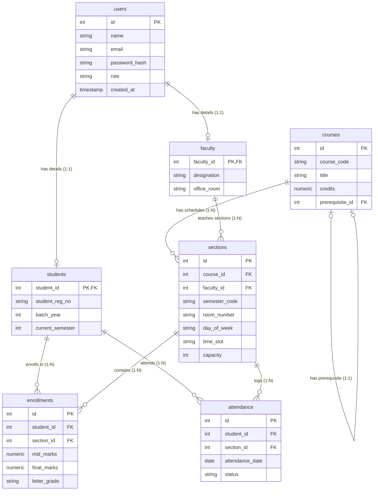

# Department Management System - Database Documentation

This document serves as a beginner-friendly guide to the database schema of the Department Management System. It explains the table structures, keys, constraints, and relationships to prepare you for your course project **viva**.

---

## 1. Entity-Relationship (ER) Diagram

Below is the conceptual layout of the database. It shows how the tables are connected and the types of relationships between them.

---

## 2. Detailed Table Descriptions

### 👤 1. `users` Table
- **Purpose**: Holds core credentials and identification for anyone accessing the system.
- **Attributes**:
  - `id` (Primary Key): Auto-incremented unique ID.
  - `name`: Full name of the user.
  - `email` (Unique): User's login address. Unique constraint prevents duplicates.
  - `password_hash`: Securely hashed password.
  - `role`: Role of the user (`'admin'`, `'faculty'`, or `'student'`).
  - `created_at`: Date and time the account was registered.

### 🎓 2. `students` Table
- **Purpose**: Holds additional data specific only to student accounts.
- **Relationship**: **1-to-1 Relationship** with `users`. Each student record corresponds to exactly one user record.
- **Attributes**:
  - `student_id` (Primary Key, Foreign Key): References `users.id`. If the user is deleted, this student record is deleted automatically (`ON DELETE CASCADE`).
  - `student_reg_no` (Unique): Academic registration number.
  - `batch_year`: The year the student joined.
  - `current_semester`: Semester level (1 to 8).

### 🍎 3. `faculty` Table
- **Purpose**: Holds details unique to faculty members.
- **Relationship**: **1-to-1 Relationship** with `users`.
- **Attributes**:
  - `faculty_id` (Primary Key, Foreign Key): References `users.id` (`ON DELETE CASCADE`).
  - `designation`: Faculty title (e.g. Professor, Lecturer).
  - `office_room`: Physical room allocation in the department building.

### 📚 4. `courses` Table
- **Purpose**: Stores the department's master course catalog.
- **Relationship**: **Self-Referencing Relationship** for prerequisites.
- **Attributes**:
  - `id` (Primary Key): Unique course identifier.
  - `course_code` (Unique): Course code (e.g. `CSE-311`).
  - `title`: Complete course title.
  - `credits`: Numerical credits (`1.0`, `1.5`, `3.0`, `4.0`).
  - `prerequisite_id` (Foreign Key): References `courses.id`. Indicates a course that must be completed before registering for this one.

### 🏫 5. `sections` Table
- **Purpose**: Represents scheduled class routines running for a specific semester.
- **Relationships**:
  - **Many-to-1** with `courses` (each section belongs to one course).
  - **Many-to-1** with `faculty` (each section has one instructor).
- **Attributes**:
  - `id` (Primary Key): Unique section schedule ID.
  - `course_id` (Foreign Key): References `courses.id`.
  - `faculty_id` (Foreign Key): References `faculty.faculty_id`.
  - `semester_code`: Academic term (e.g. `Summer2026`).
  - `room_number`: Class room.
  - `day_of_week` & `time_slot`: Lecture schedule slot (e.g. `Sunday` at `09:00-10:30`).
  - `capacity`: Registration size limit (default 40).
- **Key Constraints**:
  - `unique_room_schedule`: Double booking prevention (no room can host two sections at the same day, time, and semester).
  - `unique_faculty_schedule`: Instructor clash prevention (no teacher can teach two classes at the same time).

### ✍️ 6. `enrollments` Table
- **Purpose**: Junction table that records which students are registered for which class sections, and tracks their grades.
- **Relationship**: **Many-to-Many Relationship** between `students` and `sections`.
- **Attributes**:
  - `id` (Primary Key): Unique enrollment receipt ID.
  - `student_id` (Foreign Key): References `students.student_id`.
  - `section_id` (Foreign Key): References `sections.id`.
  - `mid_marks`: Examination score (0.0 to 40.0).
  - `final_marks`: Examination score (0.0 to 60.0).
  - `letter_grade`: Automatically mapped grade letters (`A`, `B`, `C`, `F`).

### 📅 7. `attendance` Table
- **Purpose**: Tracks daily class attendance records.
- **Relationships**: Connects students and class sections by date.
- **Attributes**:
  - `id` (Primary Key): Unique attendance row ID.
  - `student_id` (Foreign Key): References `students.student_id`.
  - `section_id` (Foreign Key): References `sections.id`.
  - `attendance_date`: The calendar date of the lecture.
  - `status`: Attendance state (`'Present'` or `'Absent'`).
- **Unique Constraint**: Prevents marking a student's attendance twice for the same class section on the same date.

---

## 3. High-Yield Viva Q&A Cheat Sheet

Prepare yourself for the examiners with these typical questions:

### Q1. What is the difference between a Primary Key (PK) and a Foreign Key (FK) in your design?
- **Answer**: 
  - A **Primary Key** uniquely identifies each row in a table (e.g. `id` in `users` or `course_code` in `courses`). It cannot be null and must be unique.
  - A **Foreign Key** is a column in one table that links to a Primary Key in another table (e.g. `student_id` in `students` referencing `id` in `users`). It enforces **Referential Integrity**, meaning you cannot link to a record that does not exist.

### Q2. Why did you separate student and faculty records from the `users` table instead of storing everything in one single table?
- **Answer**: This is an implementation of **Specialization/Generalization (ISA relationship)**. The `users` table holds shared data (name, email, password), while `students` and `faculty` hold role-specific attributes (registration number vs. office room). If we merged them, we would have many `NULL` values (e.g., student rows would have null designation, and faculty rows would have null batch year).

### Q3. How do you handle Many-to-Many relationships in your schema?
- **Answer**: A student can register for multiple sections, and a section contains multiple students. To represent this, we created a **Junction Table** (also called an associative or bridge table) called `enrollments`. This table contains foreign keys referencing both `students` and `sections`.

### Q4. What does `ON DELETE CASCADE` do in your foreign key definitions?
- **Answer**: It ensures data consistency. If a user account is deleted from the `users` table, the corresponding rows in the `students` or `faculty` tables (and their registrations in `enrollments` or `attendance` tables) are automatically deleted by the database engine. This prevents leaving "orphan records" behind.

### Q5. How does your database prevent a room from being double-booked or a teacher from being scheduled in two places at once?
- **Answer**: I implemented **Unique Constraints** on the `sections` table:
  1. `UNIQUE (room_number, day_of_week, time_slot)`: Ensures a room is never booked twice for the same slot.
  2. `UNIQUE (faculty_id, day_of_week, time_slot)`: Ensures a faculty advisor is never scheduled in two rooms at the same time.

### Q6. What is the purpose of database Transactions in your backend controller code?
- **Answer**: Transactions ensure **ACID properties**, specifically **Atomicity** (All-or-Nothing). For example, when registering a new student, the system must write to both the `users` and `students` tables. If the second query fails, the transaction rolls back the first query. This prevents partially created user records in our database.
